# Smart Mirror
Project description for Smart mirror powered by MagicMirror2

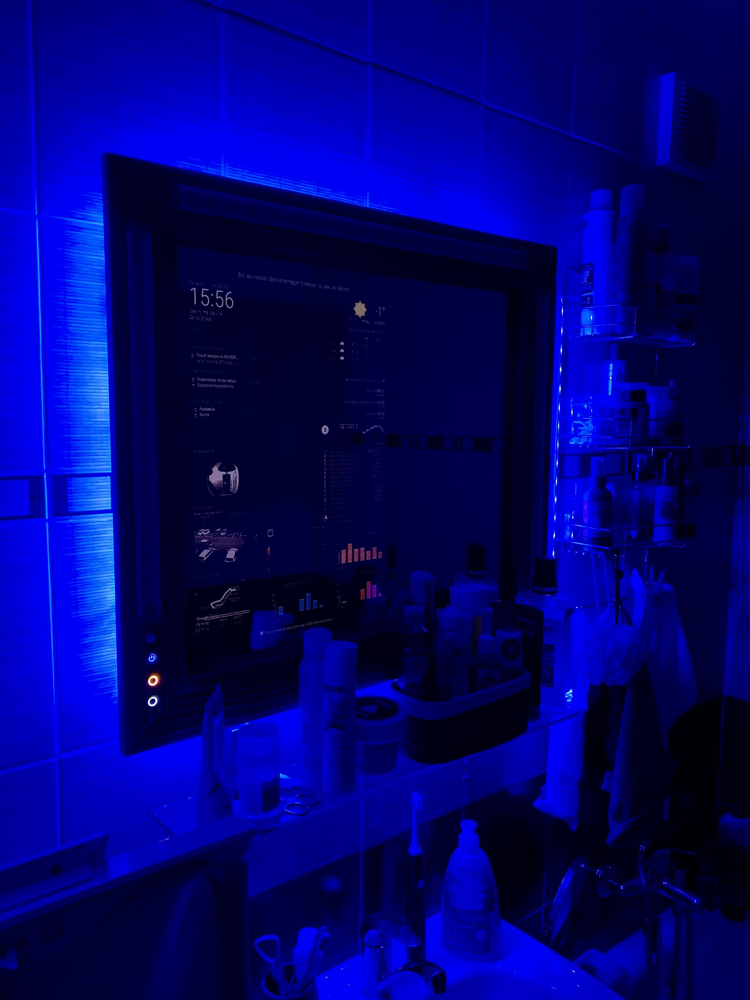
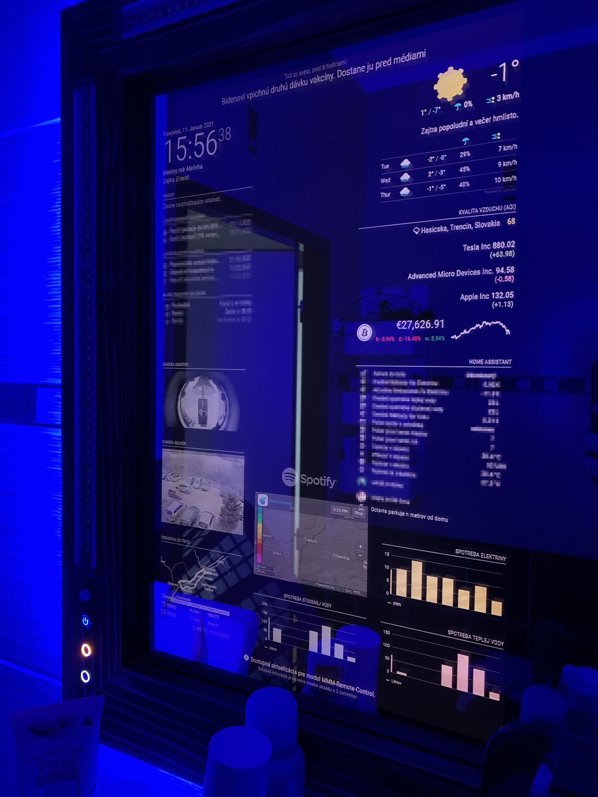

## Device features
* Two way mirror to act as normal mirror while displaying informations
* Front white light, dimmable
* Back RGB, individually addressable LEDs, for mood light and effects
* Built in speker with Raspotify service
* Enviromental measurements as temperature and humidity in room
* Motion sensor
* System is running on Raspberry pi 4 from SSD
* Powered by MagicMirrorOS in docker
* NodeRED for controlling GPIOs and logic
* Integrated into HomeAssistant as lights, and sensors. 

## Project history
This is my longest DIY project, it has been postponed several times due to lack of time or some critical problem solving. I wanted nice and ordinary looking mirror to be placed in bathroom, but with added functionality like displaying various informations, and act like good source of light. I choosed the wooden frame of this dimensions mainly because I was planning to use ordinary glass with reflecting foil from Aliexpress. As this was working somehow, I was not so happy with overall effect of reflection, and the main feature to act as mirror was struggling. 

Later I ordered proper 2 way mirror, which was hard to find in my country, so I had to order it from Czech republic. I was too lazy to redo the frame so I kept the dimensions intact. However if I've ever built another one, I've probably made it bigger, and maybe without the wooden front ring. 

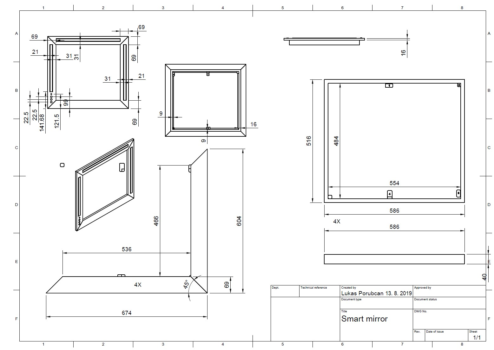

As display I used old Dell 19 inch monitor I had laying around. However I am planning to replace it by more modern one, because of power consumption and mainly heat generation. I disassembled the monitor, integrated boards inside the frame and attached it to the plastic grid I 3D printed to hold everything with zip ties. 

First generation was running on Raspberry PI 3 , however it was doing some strange mishaps, freezing sometimes, not booting correctly from SSD (Later I found out it was bad USB to SATA actually) so after acidentally frying this Raspberry (always disconnect the mains before doing something with cables) I replaced it with more powerfull Rpi4. In the meantime the MagicMirrorOS is out as docker, which is great simplification as I use docker for other projects too. 

So there are 3 buttons in front, with led underlight, and PIR sensor. 
In the bacground there is also running NodeRED, I choosed it to do all the logic of pressing buttons, activating LEDs and so on. Maybe it could be done with right addons for MagicMirror, but I don't like it to be honest. NodeREDs implementation of controlling the GPIO with PWM is kinda softwarish, so there could be moments, when you want to fade your leds, but the CPU is working on something more important and more power intensive like connecting to WiFi, and the fade of LED is suddenly blinking. This was big issue that costed me few months of thinking and giving up and trying to use the most simple and effective solution. I was thinking about using arduino with serial communication to NodeRED and arduino would controll MOSFET transistors with correct timing, uninterrupted by CPU spikes. I had some working solution, but it was bulky and not elegant at all. So one night I found that GPIOd (this is service running as process on Raspi itself) is able to communicate with NodeRED and it is controlling GPIO the right way without blinking. 

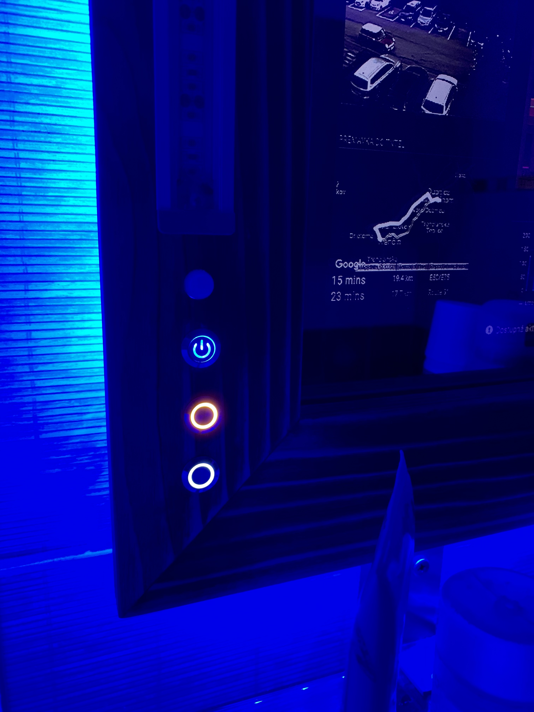

With front light sorted out, the next thing was to have some kind of effects, I used WS2812b LED strip which can be individually addressable, however the NodeRED implementation was struggling some features again. I ended up rewriting some of effects I liked to the NodeRED, and I have to say it is working as expected, so we can enjoy fire effect while taking hot bath.

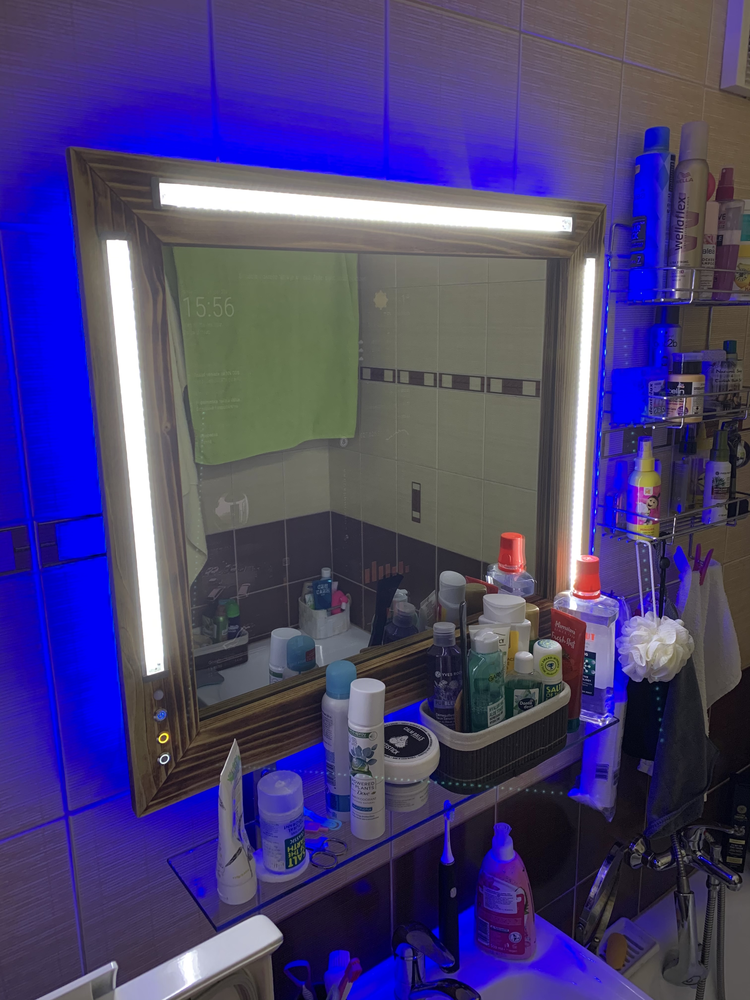

For sound, I was not able to put large speakers in the frame itself, so I ordered smallest USB speaker I could find, I agree it sounds awfull, but we are in the bathroom anyway so there never will be DOLBY like experience. Actually I was able to install some kind of equalizer for alsamixer and to tune the sound to acceptable levels. I had some trobles with USB sound card and/or built in sound interface on Raspi as it was picking up noise from power supply and so on, so the USB was better and simpler choice. 

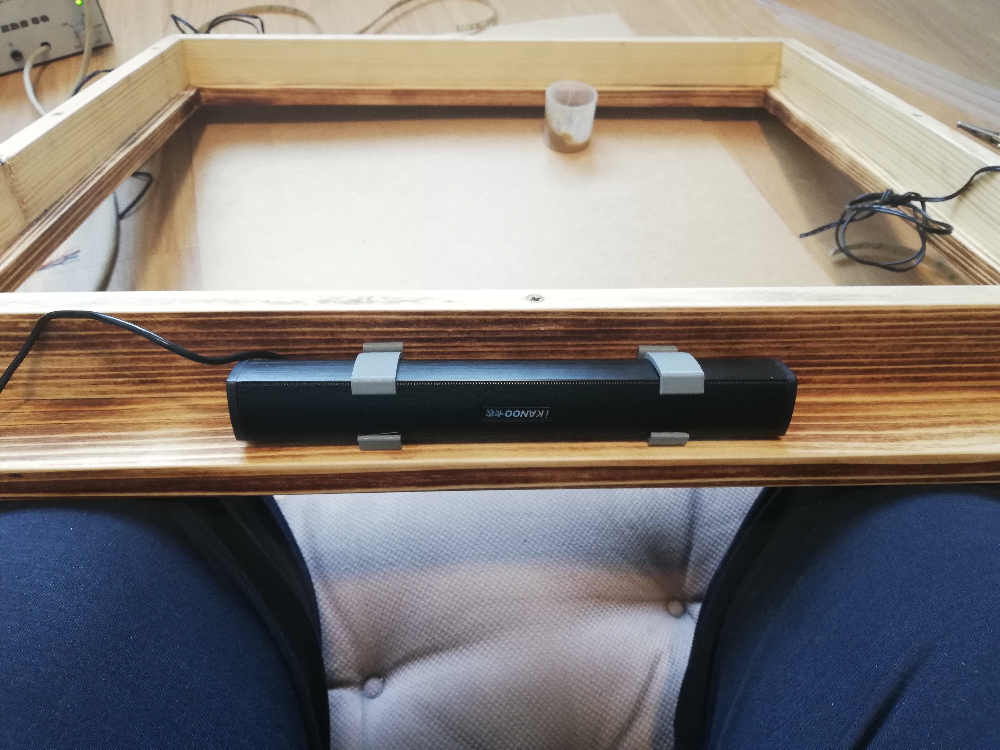

Sensing the motion was another problem, the cheap PIR I used had this strange issue of randomly triggering the signal with no motion at all. Later I found it was probably the combination of sensor itself, and the use of thin wires running along the high voltage parts of monitor. So I used ferite core filter to the signal wire from PIR, and I replaced it with even cheaper one, there are only like 3 parts on board  itself. After this, no more false movements.

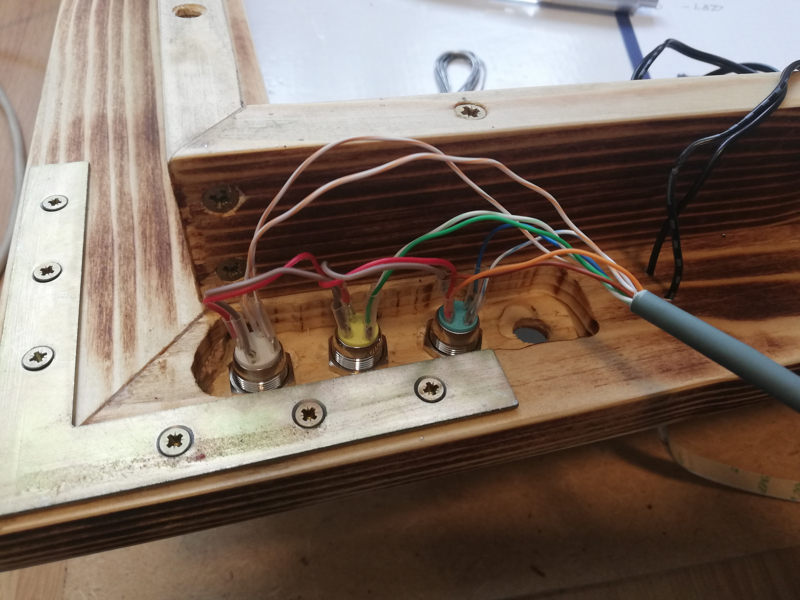

With more modern monitor with LED underlight, I think the mirror could be cooled without fan, however this old one generates quite good amount so I ended up drilling holes to the bottom and placing fan to the top. Speed of fan is controlled the same way as front LEDs, and there is simple DS18b20 temp sensor inside for monitoring internal temperature. One benefit of having "heater" behind the glass is that there is way less fog on the mirror itself :)

WiFi connectivity was one of last issues I had to solve with this project. You would think that having an AP at 4 meters from mirror would be sufficient, however if you place the raspberry behind the mirror, which is glass with thin film of silver compound, it will block enough signal to have more connection drops as you would like. Simplest solution was to drill a hole and place USB WiFi dongle at top, outside of glass shielding. 

## Connection diagram

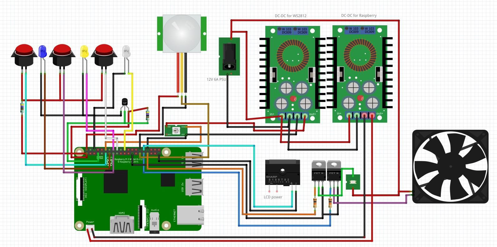

## MagicMirror config

The configuration of MagicMirror is pretty standard I think, you can find all the [basics on the web](https://magicmirror.builders/).

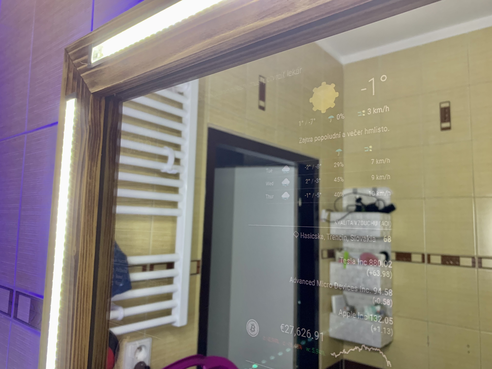 

## NodeRED

You can find all my flows for NodeRED in [Luc3as-MagicMirror-flows.json](Luc3as-MagicMirror-flows.json).

Sorry all main buttons and comments are in Slovak language, I am too lazy to translate it now. 

## Some build photos

 
 
 
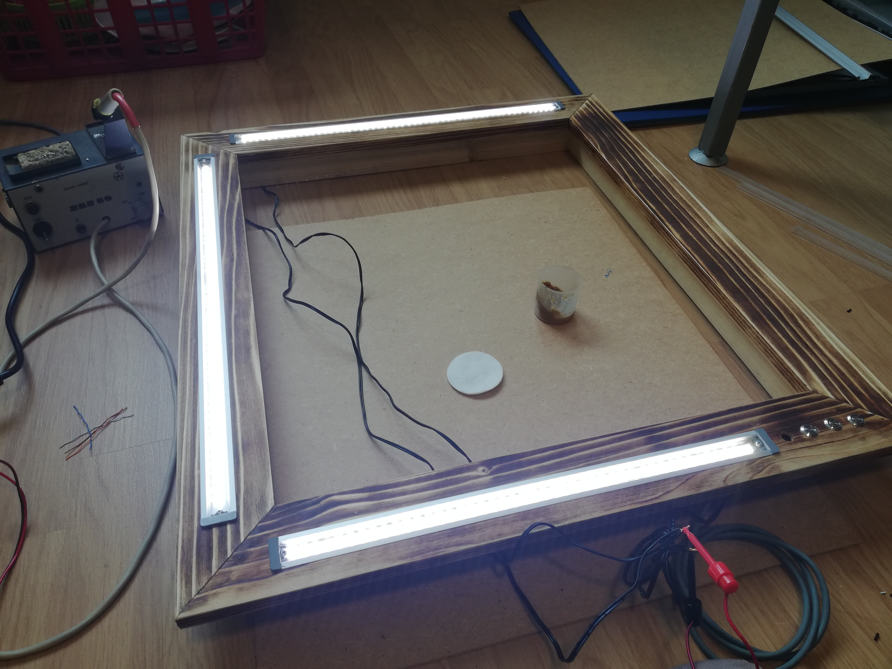 
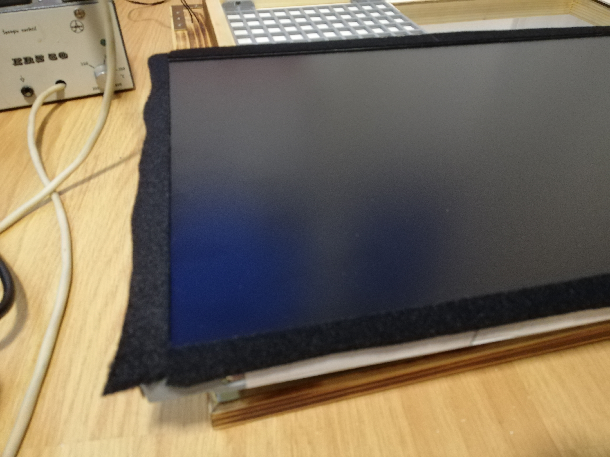 
 
 

 
 

### If You liked my work, You can buy me a coffee :)

### Or send some crypto

	
			